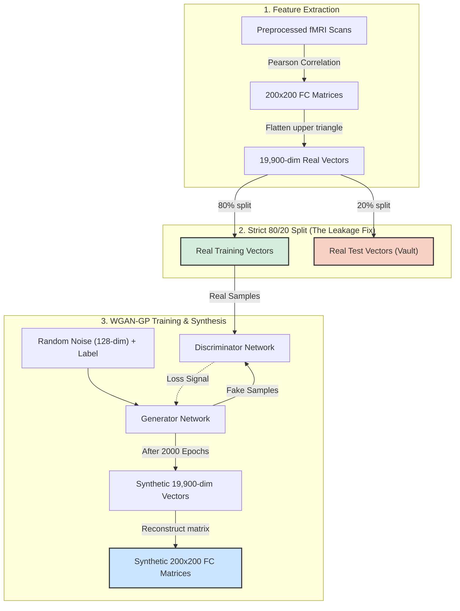
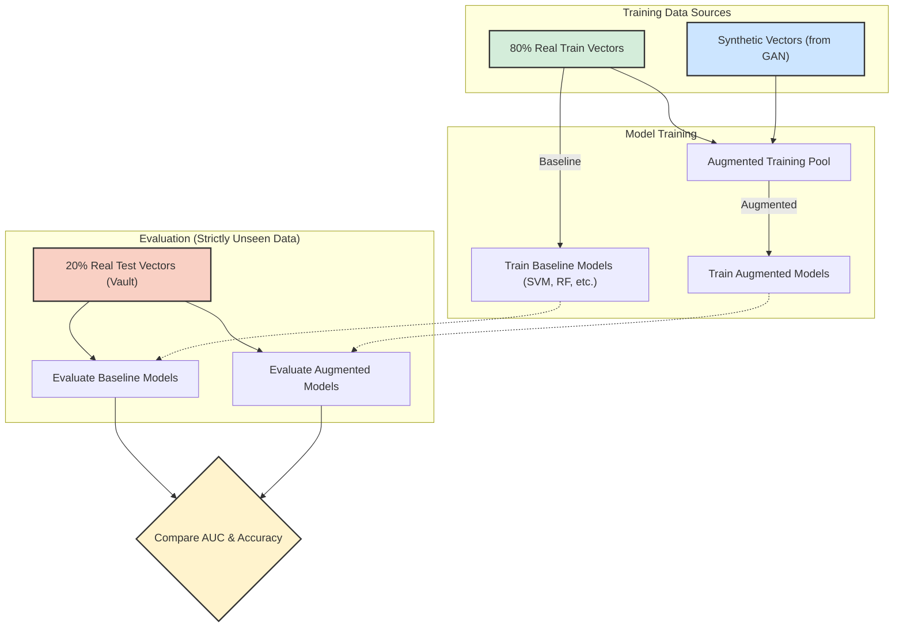

# Autism GAN Pipeline: High-Level Design (HLD)

Based on the excellent explanation you shared, here are the two visual diagrams that map perfectly to the described architecture. I have explicitly drawn the split exactly where we fixed it, so you can see how the test set is completely isolated from both the GAN and the classifier training.

## HLD Part 1: Data-Generation Flow

This diagram shows how raw fMRI data is processed into functional connectivity vectors, how the data is strictly split to prevent leakage, and how the GAN learns the statistical shape of the training subset to generate new matrices.

## HLD Part 2: Classification Flow

This diagram shows how the synthetic vectors are used strictly as a supplement to the training data. The "Vaulted" test set is brought out at the very end to evaluate both the baseline and augmented models fairly.

### The "Asterisk" Addressed
As noted in the text you shared, the red "Vault" box (the 20% Real Test Vectors) is mathematically invisible to the Generator and Discriminator in HLD Part 1. Because we modified the code to enforce this split *before* Step 2 runs, the GAN never gets to peek at the test subjects, making the final evaluation comparison (the yellow box in Part 2) 100% trustworthy.
